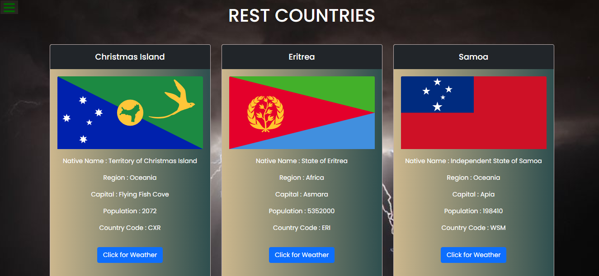

# Rest Countries List

It's a Rest countries list and it's current weather displaying website which was designed by me. It's my Guvi-Zen class Day-17 (Async : Day-2) Task.

## Tech Stack

- HTML
- CSS
- Javascript
- Bootstrap

## Lessons Learned

I learned to fetch the API data using fetch promise method and error handling throw promise method in Javascript.

## Website

[Rest_Countries_List](https://rest-countries-blue-eight.vercel.app/)

## Screenshots

## Feedback

If you have any feedback, please reach out to me at vijaymayhul@gmail.com
